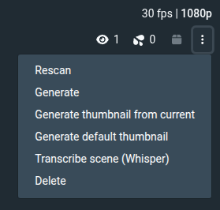

# Whisper Transcribe JAV Plugin

This Stash plugin automatically generates subtitles for video files using a
whisper.cpp server. It is a variant of the base Whisper Transcribe plugin with
extra inference options (language, temperature, suppress non-speech tokens,
initial prompt) that are useful for Japanese-language content. It installs as a
**separate** plugin so it can run alongside the original.

## Features

- Retrieves the video file for the updated scene.
- Transcribes audio and writes an `.srt` file next to the video. **Note:** This will overwrite any existing SRT files that match the naming scheme.
- Adds a UI dropdown button (via `whisper_transcribe_jav.js`) labelled **"Transcribe scene (Whisper JAV)"** to manually trigger transcription for the current scene.
- The transcribe option is now available in the three vertical dots **operations menu** alongside rescan, generate, etc.

- The plugin provides a task that can be started from the Settings window and is cancelable.
- Supports optional translation to English (`translateToEnglish` setting) and a dry‑run mode (`zzdryRun`).
- Debug tracing can be enabled with the `zzdebugTracing` setting.

## Installation

1. Place the `whisper_transcribe_jav` directory inside your Stash plugins folder
   (e.g., `~/.stash/plugins/whisper_transcribe_jav`).
2. Ensure the whisper.cpp server is running and reachable.
   - Default URL used by this plugin: `http://127.0.0.1:9191/inference`
   - Override via the "Whisper Server URL" setting or the `WHISPER_SERVER_URL` environment variable.
3. Reload plugins from the Stash UI.

## Configuration

Use the plugin settings in the Stash UI to configure behaviour:

- **serverUrl** – Whisper server inference endpoint (default `http://127.0.0.1:9191/inference`).
- **translateToEnglish** – Translate transcription to English instead of source language.
- **language** – Source language code sent to whisper (e.g. `ja`, `en`, `es`). Leave blank for auto-detect.
- **temperature** – Decoding temperature (`0.0` = most deterministic). Leave blank to use the server default.
- **suppressNonSpeechTokens** – Suppress non-speech tokens (e.g. music, sound effects) in the output.
- **initialPrompt** – Optional context prompt to guide transcription (e.g. domain vocabulary or expected phrasing).
- **zzdebugTracing** – Enable additional debug logs.
- **zzdryRun** – When enabled, no files are created; actions are only logged.
- **timeout** – Timeout in seconds for contacting the Whisper server (default `3600`).

You can also set the `WHISPER_SERVER_URL` environment variable to override the server URL.
The optional `whisper_transcribe_settings.py` remains for advanced overrides.

## Troubleshooting

- Connection refused to whisper server: Ensure the server is running and that the "Whisper Server URL" points to the correct host/port. You can set it in the plugin settings or export `WHISPER_SERVER_URL` before launching Stash. The plugin checks reachability before doing any work and logs a clear error if unreachable.
- After transcription completes, refresh the scene or navigate away and back to see the new captions appear as an option in the player.

## Development

The core logic lives in `whisper_transcribe_jav.py` and is self-contained.
It does not depend on files outside this plugin directory.

Feel free to extend the plugin with additional settings, UI elements, or
hooks as needed.
